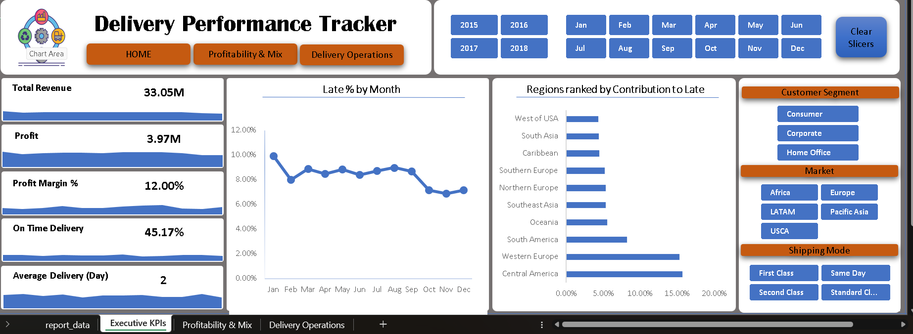
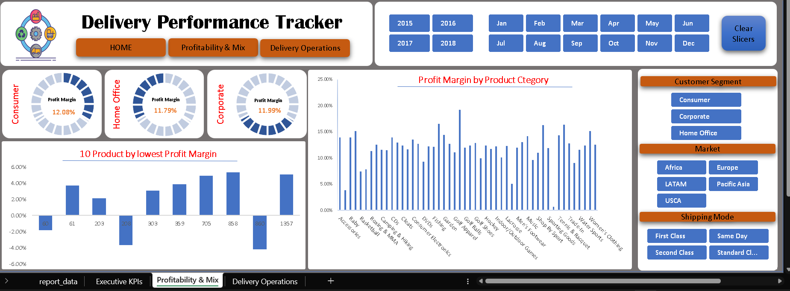
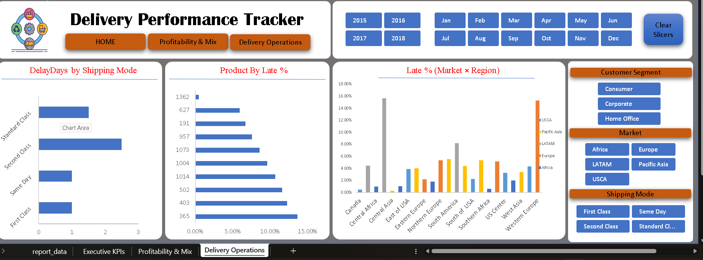

# 📊 Supply Chain Performance Dashboard

## 📂 Dataset
This project uses the **Supply Chain Dataset** available on Kaggle:  
[Supply Chain Dataset by Dhanush Katharanga](https://www.kaggle.com/datasets/dhanushkatharanga/supply-chain-dataset)

---

## 🚀 Project Overview
This project analyzes supply chain operations to identify **late delivery risks** and **profitability challenges**.  
The dashboard is built in **Excel** using cleaned and validated data.

---

## 📈 Dashboard Pages

### 1. Executive KPIs  
  
Shows KPIs like Sales, Profit, Profit Margin %, On-Time %, Avg Delay, plus Late % trends and Late % by region.

---

### 2. Profitability & Mix  
  
Highlights profit margins across categories and customer segments, along with top/bottom product and customer insights.

---

### 3. Delivery Operations  
  
Covers delivery performance by shipping mode, Avg Delay, and Late % by region and market.

---

## 🛠️ Tools & Skills Demonstrated
- **Excel (Power Pivot, Pivot Tables, Slicers, Charts)** – Built interactive dashboards  
- **Python (Pandas)** – Data cleaning and preprocessing  
- **SQL** – Data validation and reconciliation  

---

## 📌 How to Use
1. Download dataset from Kaggle (link above).  
2. Run preprocessing script (Python/SQL).  
3. Open Excel dashboard and interact with slicers (Month, Year, Market, Region, etc.).  

---

## 🔮 Future Enhancements
- Power BI migration for enhanced interactivity  
- Predictive analytics for delivery delays  
